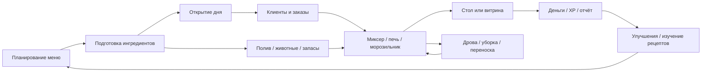

# Игровые системы Lemon Cake

Область: установленный build `6596857`. Ниже — функциональная карта по данным и разобранному Blueprint-байткоду. Точные поля и вызовы можно искать через [инструменты](REPRODUCE.md), числа — в [FORMULAS.md](FORMULAS.md). Наличие функции в архиве не доказывает, что каждый её путь достижим при обычной игре.

## Основной цикл

Игрок управляет пекарней: планирует меню, получает ингредиенты, смешивает продукты, использует печи/морозильник, обслуживает клиентов, убирает и покупает улучшения. Greenhouse, Kitchen, Store и Bedroom явно представлены в `ENUM_Location`. Состояние и UI организованы вокруг одного `BP_Player`, а не серверной многопользовательской архитектуры.

Это аналитическая схема связей, не восстановленный граф редактора.

## Владельцы и точки входа

| Система | Основные пакеты | Что сохранено / где продолжать |
| --- | --- | --- |
| Время суток | `Daily/BP_DailyCycle`, `INT_Daily` | `StartDailyCycle`, `StartDailyTimer`, `SetDayStage`, `AddTime`, `EndDayEarly`, `CheckClients`, `DailyReset` |
| Игрок, XP, деньги, sprint | `Player/BP_Player` | `AddMoney`, `GainExperience`, `LevelUp`, `CheckLevel`, input events, achievement events |
| Доступные ингредиенты и рецепты | `Items/BP_RecipeBook` | `UnlockedIngredients`, `UnlockedRecipes`, `LearnedRecipes`, `NewRecipes`, `DailyRecipes`, history arrays |
| Приготовление | `BP_KitchenMixer`, `BP_KitchenOven`, `BP_Freezer`, `BP_Item` | Проверки предмета/рецепта, готовность, cooked/burned item, таймеры, перемещение предметов |
| Выращивание | `BP_ItemSpawner`, `Greenhouse/BP_Animal`, `BP_Chicken`, `BP_Coww` | Разблокировка, вода, уход, spawn timers; overrides уровня в WORLD |
| Заказы и витрина | `Shop/BP_Client`, `BP_ClientSpawner`, `BP_StoreCounter` | Поиск стола, выбор еды, покупка с витрины, ожидание, реакция, уход |
| Столы и посуда | `BP_ClientChair`, `BP_ClientDish` | Занятость, plate/menu/coffee, обслуживание и очистка |
| Помощник | `BP_Assistant` | Вызовы подачи кофе/еды и очистки посуды, взаимодействие с клиентами |
| Кошки | `BP_CatCafe`, `BP_Cat`, `BP_Client` | Создание кошек, поиск/усыновление, награда, число доступных кошек |
| Уборка и скорость | `BP_SpillSpawner`, `BP_Spill`, `BP_MagicBroom` | Создание пятен, очистка, связь с игроком и достижениями |
| Доставка ингредиентов | `BP_ItemRail`, `BP_ItemRailSpawner` | Позиции рельса, предметы и передача миксеру |
| Спальня | `Bedroom/BP_Bed`, `BP_Library`, `BP_Wardrobe`, `BP_BedroomTable`, `BP_Pet*` | Сон/переходы, книги, гардероб, кошка/собака/кролик |
| Мини-игра | `Minigame/BP_BugMinigame`, `BP_BugSpawner`, `BP_Bug`, `BP_Net` | Типы насекомых Common/Rare/Epic, отдельный таймер, диалоги до/после |
| Обучение и диалоги | `BP_Ghost`, `BP_TutorialArrow`, `WBP_Dialogue`, `DAT_Tutorial` | 21 строка шагов, 3D-arrow coordinates, tutorial dialogue |
| Музыка и переходы | `Music/BP_Music`, `Location/BP_Location` | Вызовы и зависимости, конфигурация и ссылка на ассеты |

Префикс `Blueprints/` опущен. Точные пути и полный набор функций: [ASSET_MAP.md](ASSET_MAP.md).

## День и подготовка

Enum стадий: `Start Day`, `Morning`, `Lunch`, `Evening`. `BP_DailyCycle` управляет таймерами и рассылает события через `INT_Daily`; HUD отображает время. Стартовая подготовка и переходы обучения имеют отдельные ветви. После прекращения появления клиентов есть проверка оставшихся клиентов с периодом 3 секунды. Не сводить все состояния к одному фиксированному восьмиминутному таймеру: это уже адаптация cake-game.

## Приготовление и переноска

`DAT_Item` описывает 98 предметных строк. Типы `Ingredient`, `Mixed`, `Food`, `Tool` различаются; enum `Food` имеет ID `NewEnumerator3`, поэтому нельзя предполагать непрерывную авторскую нумерацию enum-имён. `DAT_Recipe` содержит 42 строки, семь категорий: Bread, Cookie, Donut, Cake, Pie, Candy, Frozen.

`BP_RecipeBook` собирает доступные ингредиенты из разблокированных `BP_ItemSpawner`. Он хранит отдельные списки доступных и изученных рецептов. `WBP_RecipeNew` добавляет выбранный рецепт в `LearnedRecipes`. Следовательно, поле `unlockLevel` нельзя восстановить просто из индекса строки DAT_Recipe: в самой таблице такого поля нет.

Печь берёт `CompletedCookTime` из `DAT_Recipe.BakeTime`; время до сгорания — отдельное поле. Морозильник и миксер имеют собственные ветви. Нулевой `BakeTime` означает отсутствие печного времени в таблице, но не измеренную длительность всей работы игрока. Активная переноска связана с `BP_Player.CurrentItem`, дополнительными counter/tray/rail объектами.

## Клиенты

`BP_ClientSpawner` создаёт клиентов и назначает им параметры. `BP_Client` содержит разные пути покупки с витрины и обслуживания за столом: `FindTable`, `PickFood`, `FindCounterFood`, `BuyCounterFood`, `EatFood`, `FoodReaction`, `LeaveShop`.

`Patience` — накопленное ожидание: оно растёт, а не убывает. Путь `ServeCoffee` сбрасывает его в ноль. Обучающий клиент исключён из обычного наращивания ожидания. Для занятого места сохраняются ссылки на chair/dish; после продажи идут анимации, реакция и освобождение ресурсов. Поток клиентов зависит от стадии, уровня и `ClientMultiplier`; не приписывайте его напрямую `BonusPercentage`, который используется в найденном пути чаевых.

## Прогресс и облегчение работы

Четыре категории покупки по 12 записей: Store, Kitchen, Greenhouse, Bedroom. Внутри них встречаются дополнительные витрины, печи, растения, кофе, кошачье кафе, помощник, рельс, полив и украшения. `WBP_ShopSingle` исполняет последствия покупки, включая изменение существующих акторов по тегам. `Number` и положение строки сами по себе не восстанавливают все prerequisites дерева.

Пример связи по коду: улучшение печи присваивает `BurnedCookTime=60`, тогда как class default равен 30. Это уменьшает требование к скорости забора готовой еды; не изменяет автоматически `DAT_Recipe.BakeTime`.

## Вне основного цикла

Архив также содержит гардероб, сохранение внешности, книги, питомцев спальни и мини-игру ловли насекомых. Эти системы проиндексированы, но последовательности событий, все условия доступа и визуальные детали не пройдены в runtime. Полные локальные диалоги и string table сохранены отдельно; [OPEN_QUESTIONS.md](OPEN_QUESTIONS.md) перечисляет оставшуюся проверку.
