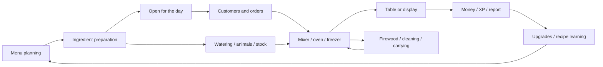

# Lemon Cake gameplay systems

Scope: installed build `6596857`. This is a functional map based on data and decoded Blueprint bytecode. Use the [tools](REPRODUCE.md) to locate exact fields and calls, and [FORMULAS.md](FORMULAS.md) for values. A function's presence in the archive does not prove every path is reachable during normal play.

## Core loop

The player manages a bakery: plans a menu, obtains ingredients, mixes products, uses ovens/the freezer, serves customers, cleans, and buys upgrades. Greenhouse, Kitchen, Store, and Bedroom are explicitly represented in `ENUM_Location`. State and UI are organized around a single `BP_Player`, rather than a multiplayer server architecture.

This is an analytical relationship diagram, not a recovered editor graph.

## Owners and entry points

| System | Main packages | Preserved evidence / where to continue |
| --- | --- | --- |
| Time of day | `Daily/BP_DailyCycle`, `INT_Daily` | `StartDailyCycle`, `StartDailyTimer`, `SetDayStage`, `AddTime`, `EndDayEarly`, `CheckClients`, `DailyReset` |
| Player, XP, money, sprint | `Player/BP_Player` | `AddMoney`, `GainExperience`, `LevelUp`, `CheckLevel`, input events, achievement events |
| Available ingredients and recipes | `Items/BP_RecipeBook` | `UnlockedIngredients`, `UnlockedRecipes`, `LearnedRecipes`, `NewRecipes`, `DailyRecipes`, history arrays |
| Cooking | `BP_KitchenMixer`, `BP_KitchenOven`, `BP_Freezer`, `BP_Item` | Item/recipe checks, readiness, cooked/burned items, timers, item movement |
| Growing | `BP_ItemSpawner`, `Greenhouse/BP_Animal`, `BP_Chicken`, `BP_Coww` | Unlocking, water, care, spawn timers; level overrides in WORLD |
| Orders and displays | `Shop/BP_Client`, `BP_ClientSpawner`, `BP_StoreCounter` | Finding a table, choosing food, display purchases, waiting, reactions, leaving |
| Tables and dishes | `BP_ClientChair`, `BP_ClientDish` | Occupancy, plate/menu/coffee, serving and cleaning |
| Assistant | `BP_Assistant` | Coffee/food service and dish-cleaning calls, customer interaction |
| Cats | `BP_CatCafe`, `BP_Cat`, `BP_Client` | Cat creation, search/adoption, rewards, available cat count |
| Cleaning and speed | `BP_SpillSpawner`, `BP_Spill`, `BP_MagicBroom` | Spill creation, cleaning, connections to the player and achievements |
| Ingredient delivery | `BP_ItemRail`, `BP_ItemRailSpawner` | Rail positions, items, transfer to the mixer |
| Bedroom | `Bedroom/BP_Bed`, `BP_Library`, `BP_Wardrobe`, `BP_BedroomTable`, `BP_Pet*` | Sleep/transitions, books, wardrobe, cat/dog/bunny |
| Minigame | `Minigame/BP_BugMinigame`, `BP_BugSpawner`, `BP_Bug`, `BP_Net` | Common/Rare/Epic bug types, separate timer, before/after dialogue |
| Tutorial and dialogue | `BP_Ghost`, `BP_TutorialArrow`, `WBP_Dialogue`, `DAT_Tutorial` | 21 step rows, 3D arrow coordinates, tutorial dialogue |
| Music and transitions | `Music/BP_Music`, `Location/BP_Location` | Calls and dependencies, configuration, asset references |

The `Blueprints/` prefix is omitted. Exact paths and the full function inventory: [ASSET_MAP.md](ASSET_MAP.md).

## Day and preparation

Stage enum: `Start Day`, `Morning`, `Lunch`, `Evening`. `BP_DailyCycle` manages timers and broadcasts events through `INT_Daily`; the HUD displays time. Initial preparation and tutorial transitions have separate branches. After customer spawning stops, remaining customers are checked every 3 seconds. Do not reduce all states to one fixed eight-minute timer: that is a cake-game adaptation.

## Cooking and carrying

`DAT_Item` describes 98 item rows. `Ingredient`, `Mixed`, `Food`, and `Tool` are distinct types; the `Food` enum ID is `NewEnumerator3`, so authored enum names must not be assumed to have consecutive numbering. `DAT_Recipe` contains 42 rows across seven categories: Bread, Cookie, Donut, Cake, Pie, Candy, Frozen.

`BP_RecipeBook` collects available ingredients from unlocked `BP_ItemSpawner` instances. It keeps separate lists of available and learned recipes. `WBP_RecipeNew` adds the selected recipe to `LearnedRecipes`. Therefore, `unlockLevel` cannot be recovered from the DAT_Recipe row index: the table has no such field.

The oven takes `CompletedCookTime` from `DAT_Recipe.BakeTime`; the grace period before burning is a separate field. The freezer and mixer have their own branches. Zero `BakeTime` means no oven time is recorded in the table, not that the player's entire preparation time was measured as zero. Carrying uses `BP_Player.CurrentItem` and additional counter/tray/rail objects.

## Customers

`BP_ClientSpawner` creates customers and assigns their parameters. `BP_Client` has separate paths for display purchases and table service: `FindTable`, `PickFood`, `FindCounterFood`, `BuyCounterFood`, `EatFood`, `FoodReaction`, `LeaveShop`.

`Patience` is accumulated waiting: it increases rather than decreases. `ServeCoffee` resets it to zero. Tutorial customers are excluded from normal waiting accumulation. Occupied seats retain chair/dish references; sales are followed by animations, reactions, and resource release. Customer flow depends on the stage, level, and `ClientMultiplier`; do not attribute it directly to `BonusPercentage`, which appears in the identified tip path.

## Progression and workload reduction

There are four purchase categories with 12 entries each: Store, Kitchen, Greenhouse, Bedroom. They include additional displays, ovens, plants, coffee, the cat cafe, assistant, rail, watering, and decorations. `WBP_ShopSingle` applies purchase effects, including changing existing actors by tag. `Number` and row position alone do not recover every tree prerequisite.

One code-confirmed example: the oven upgrade assigns `BurnedCookTime=60`, while the class default is 30. This gives the player more time to collect cooked food; it does not automatically change `DAT_Recipe.BakeTime`.

## Outside the core loop

The archive also contains the wardrobe, appearance saving, books, bedroom pets, and the bug-catching minigame. These systems are indexed, but their event sequences, all access conditions, and visual details have not been exercised at runtime. Complete local dialogue and the string table are preserved separately; [OPEN_QUESTIONS.md](OPEN_QUESTIONS.md) lists remaining verification.
